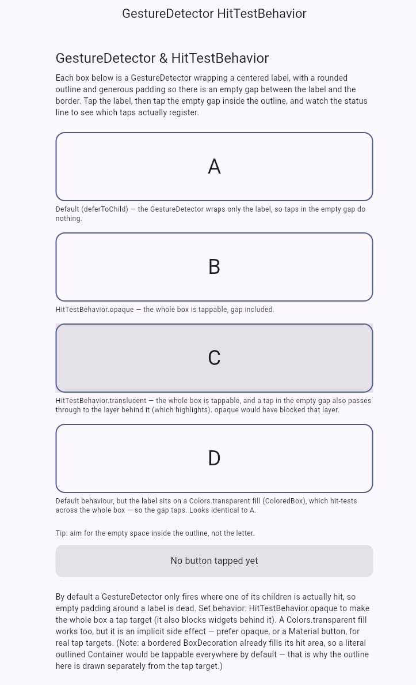

# GestureDetector & HitTestBehavior — interactive Flutter demo

An interactive demo of how Flutter's [`GestureDetector`](https://api.flutter.dev/flutter/widgets/GestureDetector-class.html)
`behavior` (the [`HitTestBehavior`](https://api.flutter.dev/flutter/rendering/HitTestBehavior.html)
enum) decides **which** taps register — and why a tap in the empty padding
around a label sometimes does nothing at all.

**▶ Live demo: <https://ddikman.github.io/flutter-hit-test-behaviour-example/>**



## The problem

Wrap a label in a `GestureDetector`, give it some padding and a rounded
outline, and it *looks* like a button — so you expect the whole thing to be
tappable. By default it isn't: tapping the empty space between the label and
the border does nothing.

That's because a `GestureDetector` with a child defaults to
`HitTestBehavior.deferToChild` — it only fires where one of its **children** is
actually hit. Empty padding has no child to hit, so it's dead.

## The four cases in the demo

Each box is the same outlined label; only the hit-test wiring differs. Tap the
letter, then tap the empty gap inside the outline, and watch the status line.

| Box | Wiring | Tapping the gap |
|-----|--------|-----------------|
| **A** | default (`deferToChild`) | **dead** — only the letter is hit-testable |
| **B** | `HitTestBehavior.opaque` | **registers** — the whole box is a tap target |
| **C** | `HitTestBehavior.translucent`, stacked over a raw `Listener` | **registers**, and the tap *passes through* to the layer behind (which highlights). `opaque` would have blocked it. |
| **D** | default behaviour + a `Colors.transparent` fill (`ColoredBox`) | **registers** — the colored box hit-tests across the whole area. Looks identical to A. |

## The subtlety most write-ups miss

It's commonly claimed that "a bordered, no-background `Container` has a dead gap
by default." That's **wrong**, and it's verifiable in the framework source.
`BoxDecoration.hitTest` returns a hit across the **whole shape** regardless of
fill (it's pure geometry — `RRect.contains`), surfaced via
`RenderDecoratedBox.hitTestSelf`. So a literal outlined `Container` under a
default `GestureDetector` is tappable *everywhere*.

That's why this demo draws the outline as a **frame around** the tap target —
the border lives on a parent `DecoratedBox`, outside the `GestureDetector`'s
child subtree — rather than as a decoration on it. Otherwise the contrast
between A and B would vanish.

A couple of related details the demo leans on:

- **The transparent-fill trick (box D).** `Container(color: …)` / `ColoredBox`
  hit-tests its full area because `_RenderColoredBox` is constructed with
  `HitTestBehavior.opaque`. That's the only reason a `Colors.transparent` fill
  makes the gap tappable. (`Container(decoration: BoxDecoration(color: …))`
  fills the hit area too, but via geometry, not opaqueness.)
- **opaque vs translucent (box C).** For an *isolated* button they register
  taps identically; the difference only shows when something sits behind the
  detector. A competing second `onTap` behind it wouldn't fire either —
  Flutter's gesture arena resolves a tap to a single winner — so box C puts a
  raw pointer `Listener` behind it to make the pass-through observable.

## Recommendation

For real tap targets, prefer an explicit `behavior: HitTestBehavior.opaque` —
or, better, a Material widget like `InkWell` / `TextButton` / `IconButton`,
which handle the hit area, semantics and ripple for you. Reach for a raw
`GestureDetector` only when you need a custom gesture. Avoid leaning on a
`Colors.transparent` fill: it works by side effect and reads as a mistake to
the next developer. And keep tap targets at least 48×48 logical pixels.

## Running it locally

```bash
flutter pub get
flutter run -d chrome   # or any connected device
flutter test            # the tests encode the behaviour above
```

The widget tests in [`test/widget_test.dart`](test/widget_test.dart) are the
executable version of the table: they assert that A's gap is dead, B's and D's
are live, and C's passes through to the layer behind.

## How it's deployed

[`.github/workflows/deploy.yml`](.github/workflows/deploy.yml) builds the web
app and publishes it to GitHub Pages on every push to `main`:

```bash
flutter build web --release --base-href /flutter-hit-test-behaviour-example/
```

The `--base-href` matches the repository name so assets resolve under the
project Pages path.

## Where the code lives

The whole demo is a single file — [`lib/main.dart`](lib/main.dart).
